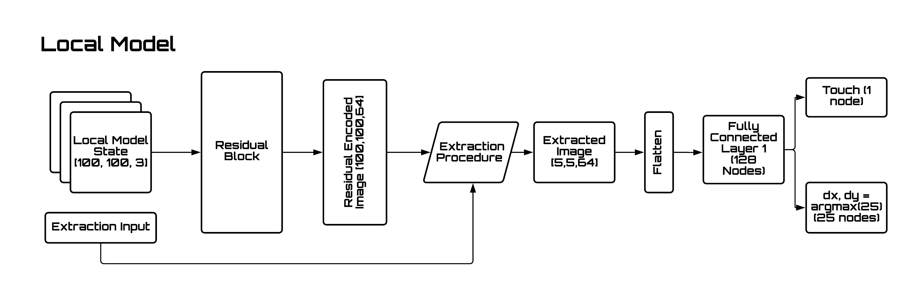
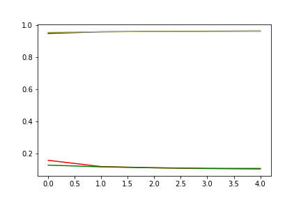

# Teaching Robots To Draw

Implementation of paper Teaching Robots to Draw by Atsunobu Kotani and Stefanie Tellex

## Local Model

local model accuracy : 96.4%

local model architecture:

training plot :

## Global Model

yet to train

## Datasets

custom made datasets for this project can be found here:

	https://github.com/prajwaltr93/kanjivg_dataset

derprecated dataset:

	https://github.com/prajwaltr93/hershey_dataset

## TODO :

07/08/2020

- [x] train local model

- [x] generate learning curves for local model

15/08/2020

- [x] add vaidation and test datasets and respective loss

28/08/2020

- [x] train on local model on google colab

- [ ] complete final python script and finish project

29/10/2020

- [ ] train global model

- [ ] add legend to training local plot 
