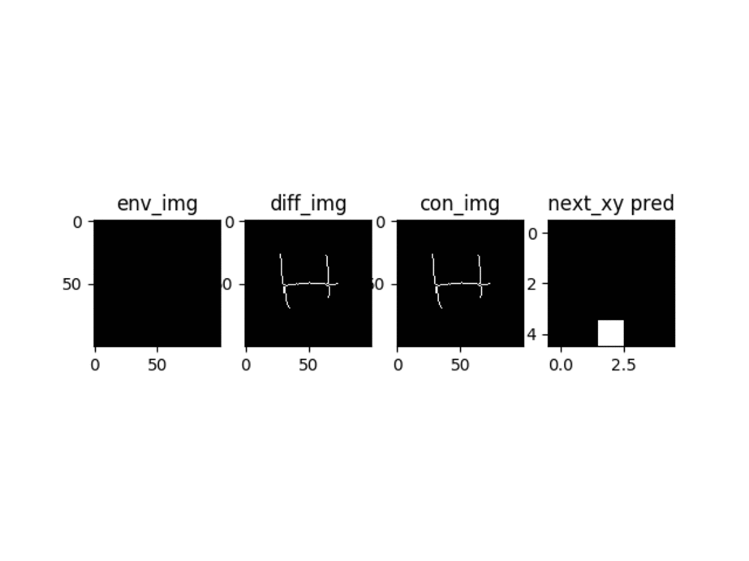

# Teaching Robots To Draw

Implementation of paper Teaching Robots to Draw by Atsunobu Kotani and Stefanie Tellex

## Local Model

cropped next_xy accuracy : 96.4%

touch accuracy : 99.0%

local model architecture:

training plot :

feature histogram for local dataset looks like this :

classes are heavily skewed, so accuracy might not be the best metric to analyse local model performance.
20 characters were choosen from dataset, and recall scores for each class were calculated:

except for class 2 and 13, every other class seems to be generalising well.

### Writing Bot is up and Running !!

1. Test stroke

2. Handwritten A

3. Handwritten H

## Global Model

Global Model architecture

## Datasets

custom made datasets for this project can be found here:

	https://github.com/prajwaltr93/kanjivg_dataset

derprecated dataset:

	https://github.com/prajwaltr93/hershey_dataset

## TODO :

07/08/2020

- [x] train local model

- [x] generate learning curves for local model

15/08/2020

- [x] add vaidation and test datasets and respective loss

28/08/2020

- [x] train on local model on google colab

- [x] complete final python script and finish project

29/10/2020

- [x] train global model

- [ ] add legend to training local plot

08/01/2021

- [ ] retrain global and local model with more samples for robustness

- [x] test writing bot on real world handwritten image

- [x] add global model architecture diagram

### Conclusion

Even though the project is complete, it is incomplete or can be improved in following areas:

**Trained Global Model is not Robust enough**

reasons :

1. without the use of MaxPool Layer in between the last two layers of global model it would have been impossible to train on Google Colab due to GPU VRAM Limitation, the model is just too large with (100 * 100 * 64) fully-connected to (100 * 100)

2. Training time is really slow (partially due to python generators generating data on the go), fully training on the data with all data augmentation transforms (only one transformation out of three has been implemented into the pipe line due to limited training time available) is not possible, training simply cuts off due to run-time quota.

**InSufficient Documentation on Handling strokes on top of each other**

local model tracing Strokes crossing(or in close proximity) each other will result in one stroke overwriting other, this has a side effect of splitting latter stroke into two strokes which is undesirable.

**Works only with Images with proper Lighting and with use of specific writing medium**

Use of ball-pen to write input image will result in improper results, due the use of skeletonization in preparing input image( creating strokes of one pixel wide),works best on input strokes written with color-markers or gel-pens. this might not be the limitation of paper itself, but with image skeletonization methods available at the moment.
