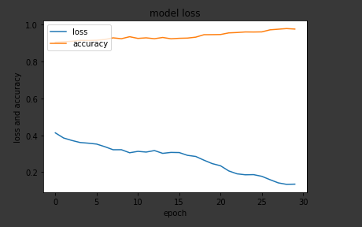
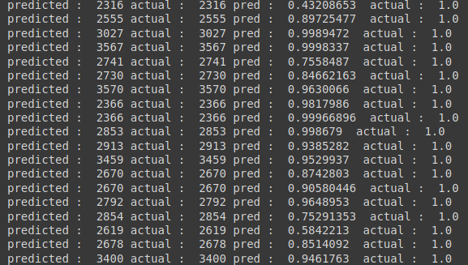

# Teaching Robots To Draw

Implementation of paper Teaching Robots to Draw by Atsunobu Kotani and Stefanie Tellex

## Datasets

custom made datasets for this project can be found here:

	https://github.com/prajwaltr93/hershey_dataset

NOTE : actual pickled datasets are not uploaded to repository! use README.md to know how to create the dataset.

## Global Model

Global Model Architecture :

Global Model has achived a accuracy of 97.3 %

Plot of Accuracy and Loss over epoch :

Snapshot of training results :

Saved Model can be found ./saved_models/global_model
## TODO :

07/08/2020

- [x] train local model

- [ ] generate learning curves for local model

15/08/2020

- [x] loading more data to model using callbacks (global model)

- [x] generate learning curves for global model

- [x] train global model

- [ ] add vaidation and test datasets and respective loss

28/08/2020

- [ ] train on local model on google colab

- [ ] complete final python script and finish project 
