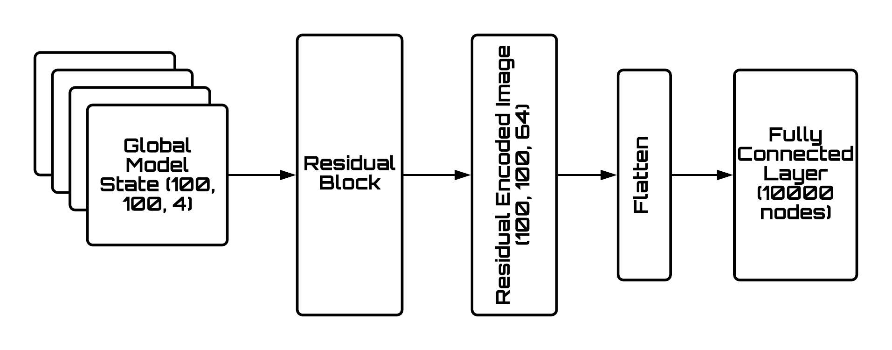

# Teaching Robots To Draw

Implementation of paper Teaching Robots to Draw by Atsunobu Kotani and Stefanie Tellex

## Local Model

cropped next_xy accuracy : 96.4%

touch accuracy : 99.0%

local model architecture:

training plot :

feature histogram for local dataset looks like this :

classes are heavily skewed, so accuracy might not be the best metric to analyse local model performance.
20 characters were choosen from dataset, and recall scores for each class were calculated:

except for class 2 and 13, every other class seems to be generalising well.

### Writing Bot is up and Running !!

## Global Model

Global Model architecture

## Datasets

custom made datasets for this project can be found here:

	https://github.com/prajwaltr93/kanjivg_dataset

derprecated dataset:

	https://github.com/prajwaltr93/hershey_dataset

## TODO :

07/08/2020

- [x] train local model

- [x] generate learning curves for local model

15/08/2020

- [x] add vaidation and test datasets and respective loss

28/08/2020

- [x] train on local model on google colab

- [ ] complete final python script and finish project

29/10/2020

- [x] train global model

- [ ] add legend to training local plot

08/01/2021

- [ ] retrain global and local model with more samples for robustness

- [ ] test writing bot on real world handwritten image

- [ ] add global model architecture diagram
